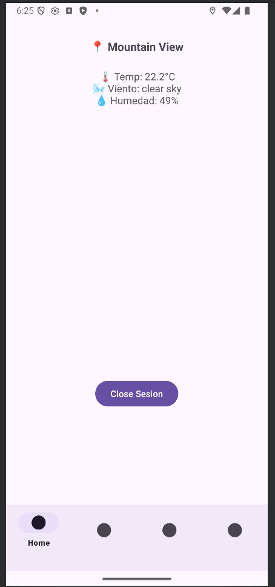
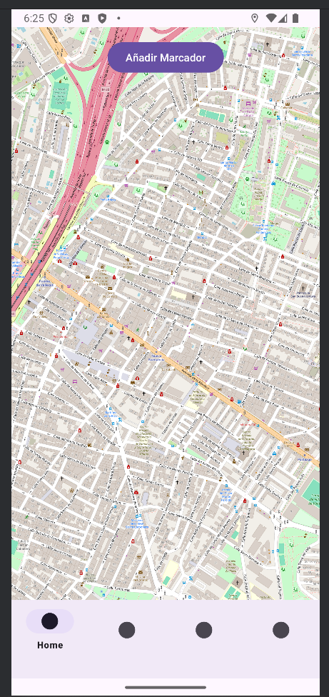
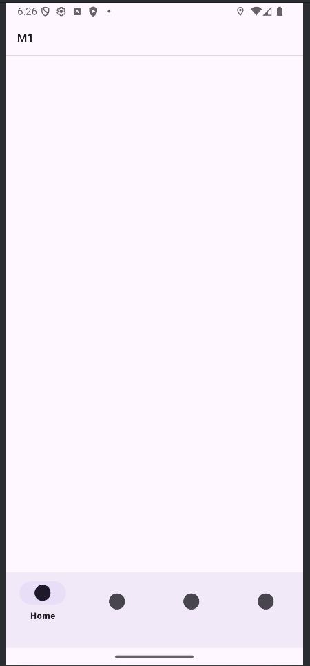
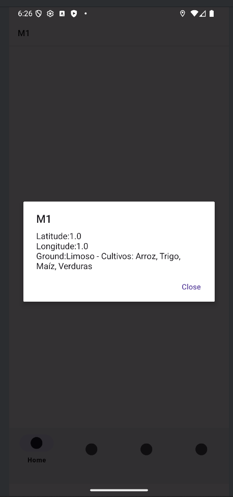
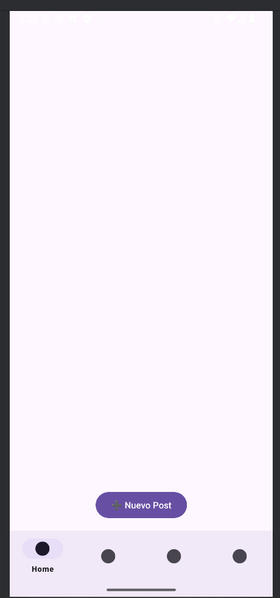
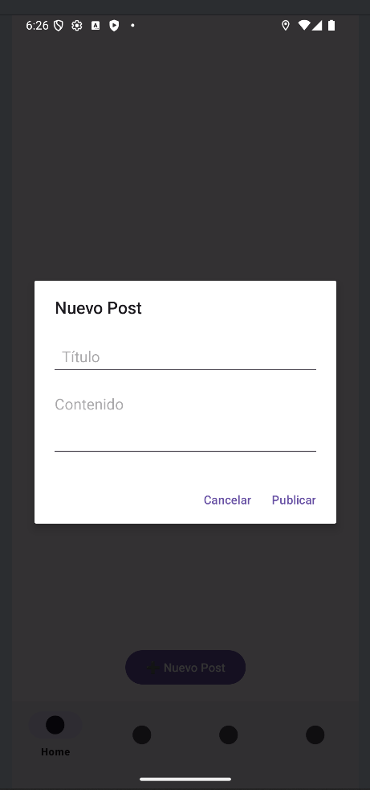
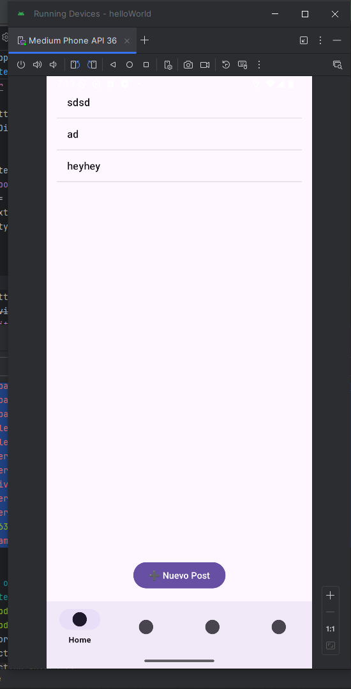

# Agrozone

## Workspace
Github:
  - Repository: [Agrozone](https://github.com/carlosir016/MAD2025)
  - Releases:  [Releases](https://github.com/carlosir016/MAD2025/releases)

## Description
Agrozone is an android application for farmers who need some information about their work. Posting notes to ask people about the type of vegteables that they can seed, and some tips to cultivate; The use of an interactive map which can be used to save markers that gives information about the the soil type; A collection page that gives information about the coordinates, the [kind of soil](https://encrypted-tbn0.gstatic.com/images?q=tbn:ANd9GcRokrlHgV8rQ8k7E6_zPtMXgfhclXihpwRC_w&s) that a place has, and the possible cultives that can be seeded; Finally, the application provide [weather information](https://openweathermap.org/api/one-call-3) about the environment in that site and moment.

## Activity's screenshots

 

<em>Figure 1: weather feature</em>
 

<em>Figure 2: Interactive map</em>

<em>Figure 3: Coordinates collection</em>

<em>Figure 4: Coordinate information</em>

<em>Figure 5: Post feature</em>

<em>Figure 6: Post creation</em>

<em>Figure 7: Post Example</em>

## Video

[Youtube](https://youtu.be/M-q15tdaecY)

## Features
  - social interaction between users
  - interactive map
  - weather request
  - login and registation activity
  - personal coordinates collection

## How to use
The aim of this section is explain to users how this application works. First of all the person who want to use the application needs credentials to access. There are two options: Log-In, in the case that the person has an user created; and register, to create a new local user. Then, the application offer some features like: a climate page, where people can see actual climate conditions; an interactive map, where  markers can be added giving the coordinates of a place, a name for that place and the type of soil that the place has; a collection page, that is a list of all the markers that were created; Eventually, a social interaction page, where public posts can be published for the community with tips and questions. In this case the a dialog page appears with to fields, the title of the post and the content to public. This post are saved on a firebase database to be shown by everyone.

## Participants
  - Carlos Andrés Ybañez c.ybanez.ruiz@alumnos.upm.es
  - Óscar Herrero Gordaliza oscar.herrero@alumnos.upm.es

Workload distribution between *(Carlos Ybañez/Óscar Herrero2)*: (50%/50%)